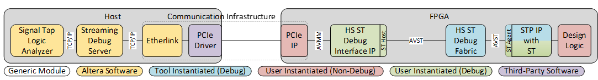
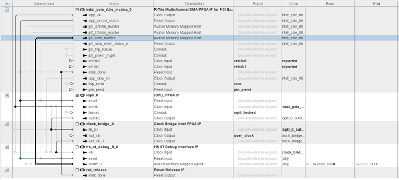
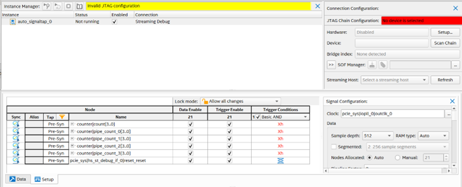
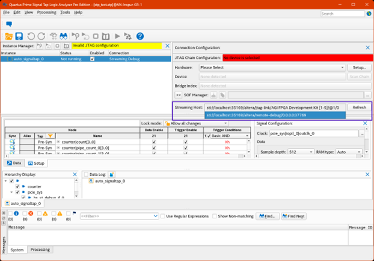
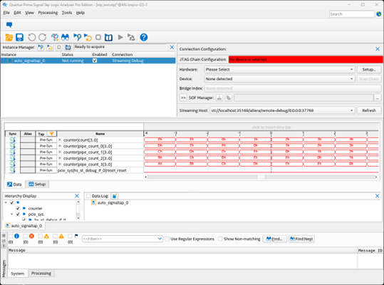

# **High Speed Streaming Remote Debugging Over PCIe Example Design**

The High Speed Streaming remote debugging example design shows how you
can use the High Speed Streaming (HS ST) Debug Interface IP in a remote
debug solution where the host and FPGA device are connected over a PCIe
interface. You can use this example as a reference for developing your
own design.

The HS ST Debug Interface IP gives you access to debugging on the FPGA
device without a physical connection to the JTAG pins on the device. The
IP requires additional infrastructure to communicate with the Streaming
Debug server. Because system designs often differ, you must create this
additional infrastructure to account for your system design.

For more information about the HS ST Debug Interface IP, refer to HS ST Debug Interface IP User Guide

This example design uses the following components to create simple
custom communication infrastructure:

- Open source etherlink application

  - This application source code is available at https://github.com/altera-opensource/remote-debug-for-intel-fpga.

- Open source Linux universal I/O PCIe drivers (uio\_pci\_driver)

  - This driver is typically available by default.

- R-tile Avalon® Memory-Mapped Intel® FPGA IP for PCI Express

In the example design, debugging applications (like Signal Tap) run on
the host machine and communicate with the Streaming Debug server on the
same machine. The etherlink application listens to the Streaming Debug
server and converts TCP/IP data into PCIe MMIO transactions that are
sent to the FPGA device where the PCIe MMIO transactions are forwarded
to the HS ST Debug Interface IP over an Avalon® Memory-Mapped interface.
The HS ST Debug Interface IP translates the communication it receives
from the Streaming Debug server into signals for the FPGA debug logic.
Debug data is sent back to the streaming debug server and debug
application in the reverse of this flow.



You can download the HS ST remote debugging over a PCIe interface
example design from the 

**Important:** Exposing the debug interface over an unsecured network
like in this example design can pose a serious security risk. Consider
securing your remote debug design with encryption through SSH tunneling.

## **Example Design Details**

The example design has a pipelined counter placed in the design solely
for you to quickly verify that the Signal Tap connection works. Signal
Tap monitors this counter so that you can verify the High Speed Streaming
remote debugging connection is working as expected. If your remote
debugging connections works as expected, you will see the repetitive
counters in the Signal Tap capture.

Hardware Design

This example design is based on an Agilex™ 7 FPGA I-Series Development
Kit (2x R-Tile and 1x F-Tile) seated into a PCIe x16 slot in a host
system running a Linux operating system that is supported by Intel®
Quartus® Prime Pro Edition Version 25.1.1 (or later).

FPGA Device Side

This FPGA device side of the example design is kept relatively simple
with the Avalon® memory mapped agent interface of the HS ST Debug
Interface IP connected directly to the BAM Master of the
R-Tile Multichannel DMA FPGA IP for PCIe. This connection allows the
PCIe interface to communicate with the streaming debug endpoint of the
FPGA device that communicate with the debug logic on the device.



This design uses PCIe BAR2 for communication.

To provide some recognizable data in the Signal Tap capture, the example
design contains a counter. To use the HS ST Debug Interface IP, the Signal Tap’s **Connection** is
configured for **Streaming Debug.**



Host Machine Side

The host machine side of the PCIe link uses open source application code
(etherlink application) along with the open source
Linux uio\_pci\_generic driver. The Streaming Debug server can then send
information back and forth across the PCIe link established between the
host and FPGA card.

## **Running the Remote Debugging Over a PCIe Interface Example Design**

Validated Environment

The example design has been validated in the following host system
environment:

- FPGA Development Kit DK-DEV-AGI027-RA (Comes with a AGIB027R29A1E1VB device)

  - For details, visit the Agilex™ 7 FPGA I-Series Development Kit (2xR-Tile and 1x F-Tile) web page.

- Operating System Ubuntu 22.04 LTS

- Required Operating System Driver uio\_pci\_generic - Provided by the operating system

- Required Application etherlink - Source code and requirements are available on GitHub at https://github.com/altera-opensource/remote-debug-for-intel-fpga

  - Instructions for downloading and compiling the etherlink application are included in the steps that follow.

- Quartus® Prime Pro Edition version 26.1

The remaining instructions assume that the Agilex™ 7 FPGA I-Series
Development Kit (2x R-Tile and 1x F-Tile) is already installed into the
host system.

Procedure

Download the High Speed Streaming remote debugging over a PCIe interface
example design:

[pcie_remote_debug_agx7_26_1.qar](./pcie_remote_debug_agx7_26_1.qar)

Use Quartus® Prime Pro to restored archived project.

1.  Use Quartus® Prime Programmer to program the Agilex™ 7
    FPGA I-Series Development Kit (2x R-Tile and 1x F-Tile) with the
    output\_files/pcie\_remote\_debug.sof programming file.

2.  Restart or reboot the host machine so that the design can go through
    the PCIe enumeration process with the newly programmed design:

    ```sh
    sudo reboot
    ```

3.  After reboot completes and you are logged back on, search for the
    FPGA card with the one of the following commands:

    ```sh
    lspci -nn | grep Altera
    ```

    You are looking for a connection that looks similar to the following one:

    ```sh
    01:00.0 Unassigned class [ff00]: Altera Corporation Device [1172:0000] (rev 01)
    ```

    In this example, the relevant information is:

    - PCIe B:D.F: 01:00.0

    - Vendor ID: 1172

    - Device ID: 0000

4.  Ensure that your FPGA card is bound to the uio\_pci\_generic PCIe
    driver as follows:

    a.  Confirm that you do not have a PCIe driver associated with the
    FPGA card with the command that follows. In the command, PCI bus
    address is 0000:01:00.0. Your card might have different device
    information.

    ```sh
    ls -l /sys/bus/pci/devices/0000:01:00.0/driver
    ```

    b.  If this command returns the following response, continue to step 6.

    ```sh
    ../bus/pci/drivers/uio_pci_generic
    ```

    c.  If the command returned “no such file or directory", continue to step 5.

    d.  If the command returned a driver other than uio\_pci\_generic,
    unbind that driver from the FPGA board with the following command:

    ```sh
    sudo bash -c 'echo -n "0000:01:00.0" > /sys/bus/pci/drivers/<existing-driver>/unbind'
    ```

5.  Load the uio\_pci\_generic driver and then use the new\_id to bind
    the UIO driver to the FPGA board. The vendor ID and device ID
    information is specific to your Agilex™ 7 FPGA I-Series Development
    Kit (2x R-Tile and 1x F-Tile) PCIe card.

    ```sh
    sudo modprobe uio_pci_generic

    sudo bash -c 'echo "<vendor_ID> <device_ID>" > /sys/bus/pci/drivers/uio_pci_generic/new_id'
    ```

    a.  Verify that the uio\_pci\_generic driver is bound to the FPGA card:

    ```sh
    ls -l /sys/bus/pci/devices/0000:01:00.0/driver
    ```

    b.  If this command returns the following response, continue to step 6.

    ```sh
    ../bus/pci/drivers/uio\_pci\_generic
    ```

    c.  If you get a does not exist response, run the following bind command:

    ```sh
    sudo bash -c 'echo -n "0000:01:00.0" > /sys/bus/pci/drivers/uio_pci_generic/bind'
    ```

    d.  Use the ls -l /sys/bus/pci/devices/0000:01:00.0/driver command to
    confirm that the uio_pci_generic driver is bound to the FPGA card.

6.  Ensure that required read and write permissions are in place for
    PCIe BAR2 with the following command:

    ```sh
    sudo chmod og+rw /sys/bus/pci/devices/0000:01:00.0/resource2
    ```

7.  Download and compile the etherlink application:

    ```sh
    git clone https://github.com/altera-fpga/remote-debug-for-intel-fpga.git

    cd remote-debug-for-intel-fpga

    cmake . -Bbuild

    cd build

    make

    make install
    ```

    The etherlink application listens to the Streaming Debug server and
    communicates with the PCIe device to read and write to the HS ST Debug
    Interface IP that handles all communication for debug applications
    within the FPGA device.

8.  Ensure that the etherlink application is executable and run the
    application with the following command:

    ```sh
    etherlink --uio-driver-path=/sys/bus/pci/devices/0000:01:00.0/resource2 --start-address=0x0000 --address-span=0x4000
    ```

    The --start-address option references the starting address for the HS ST
    Debug Interface IP in the Avalon® memory-mapped interface system
    mapping. The --address-span option references the depth of the memory
    buffers used in the HS ST Debug Interface IP.

    If the etherlink command runs successfully, you get output similar to
    the following messages:

    ```sh
    INFO: Etherlink Server Configuration:

    INFO: H2T/T2H Memory Size : 4096

    INFO: Listening Port : 0

    INFO: IP Address : 0.0.0.0

    INFO: UIO Platform Configuration:

    INFO: Driver Path: /sys/bus/pci/devices/0000:01:00.0/resource2

    INFO: Address Span: 16384

    INFO: Start Address: 0x0

    INFO: Server socket is listening on port: 36181
    ```

    The port is the TCP/IP port that the etherlink application listens to.
    After the etherlink application establishes the port, you can specify
    the port in the --port=&lt;port\_number&gt; option of the etherlink
    command.

    Take note of the listening port, IP address, and server socket port from
    the output message. You need that information in the next step.

    There are two methods for using the STI Debug server to communicate with
    etherlink: multi-threaded and multi-processing.

    - Multi-threaded Method: All connections to etherlink are managed within
    a single process

    - Multi-processing Method: Each connection to etherlink is handled by a
    separate process, offering better isolation through the operating
    system. The multi-processing method provides enhanced isolation due to
    the separation of processes by the operating system.

9.  In a new terminal session, register the host's IP address and the
    listening port with the Quartus Service Configuration Manager (SCM),
    either using the command line or GUI.

    a.  Using command line:

    Multi-threaded Method: Use the add-host sub-command for the service type sti.

        ```sh
        quartus_scm sti add-host sti_0 altera/remote-debug <etherlink ip address>:<etherlink server listening port>
        ```

    For example, using the values from Step 8:

        ```sh
        quartus_scm sti add-host sti_0 altera/remote-debug 0.0.0.0:36181
        ```

    Multi-processing Method: Use the start sub-command for the service type sti to create a new process.

        ```sh
        quartus_scm sti start sti_exe_0 --insecure --driver-name=altera/remote-debug \
        --driver-argument=<etherlink ip address>:<etherlink server listening port>
        ```

    For example, using the values from Step 7:

        ```sh
        quartus_scm sti start sti_exe_0 --insecure --driver-name=altera/remote-debug --driver-argument=0.0.0.0:36181
        ```

    b.  Using GUI:
        
    Multi-threaded Method: Use the “Add Host” button in the Client Host(s) sub-window

    Multi-processing Method: Click the “Add” button in the Instance(s) sub window. Populate the fields as needed.
    Refer to the command line example above for an example.

11.  In a new terminal session, open the SignalTap GUI.

12.  Open the STP file that contains the Streaming Debug instances using
    **File &gt; Open** or the open file icon in the toolbar.

13.  In the **Connection Configuration** pane, use the **Streaming Host**
     dropdown to choose the Streaming Host connection represented by the
     URI string for the connection you wish to use.

     Note: A JTAG connection is automatically added by Quartus and is
     presented as a Streaming Host connection.

     The URI format representing the connection to etherlink is:

     ```sh
     sti://<sti server hostname>:<listening port/altera/remote-debug/<etherlink IP address>:<listening port>
     ```

     The URI format representing the JTAG connection is:

     ```sh
     sti://<sti server hostname>:<listening port/altera/jtag-link/<JTAG Blaster hardware name>/@<device position in the chain>/<index>
     ```

Selecting Streaming Host in Signal Tap GUI



Signal Tap GUI Showing Counter Pipeline



If can see the counter pipeline, you have successfully captured FPGA
data on Signal Tap over your PCIe connection!
